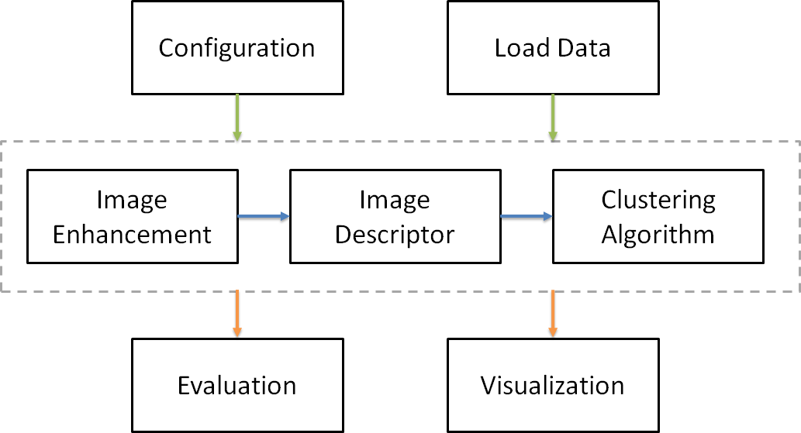

# Clustering Framework
###### Author: Aya Saad
###### Date created: 24 September 2019
A Modularized implementation for
Image enhancement, extracting descriptors, clustering, evaluation and visualization
Integrating all the algorithms stated above in one framework

---------------------------------------------------
###Installation
##### Create a conda environment
conda create -n <environment name> pip python scikit-image pandas seaborn numpy matplotlib scikit-learn scipy

ex: conda create -n clustering pip python scikit-image pandas seaborn numpy matplotlib scikit-learn scipy
##### Activate the conda environment
activate <environment name>
activate clustering

##### install opencv contribute to use the SIFT and SURF 
conda install -c michael_wild opencv-contrib

---------------------------------------------------